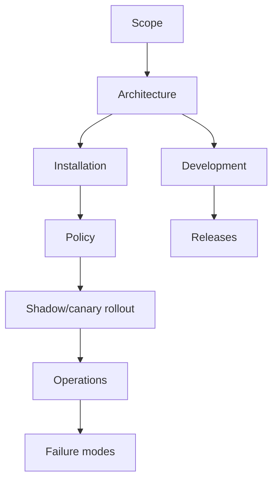

# Documentation map

A compact map of the `github-agent-bridge` documentation set.

## Start here

| Need | Document | Type |
| --- | --- | --- |
| Understand what this project is | [`../README.md`](../README.md) | Overview |
| Install a deployment | [`installation.md`](installation.md) | How-to |
| Understand system design | [`architecture.md`](architecture.md) | Explanation |
| Configure policy | [`policy-reference.md`](policy-reference.md) | Reference |
| Roll out safely | [`shadow-canary.md`](shadow-canary.md) | How-to |
| Operate production | [`operations.md`](operations.md) | How-to |
| Develop the bridge | [`development.md`](development.md) | How-to |
| Diagnose known failures | [`failure-modes.md`](failure-modes.md) | Reference |
| Understand release automation | [`releases.md`](releases.md) | Reference |
| Keep scope clean | [`scope.md`](scope.md) | Explanation |

## Mental model

## Documentation rules

- Keep **reference** documents factual and table-driven.
- Keep **how-to** documents task-oriented and procedural.
- Keep **explanation** documents focused on why the system exists and how pieces relate.
- Do not bury operational warnings inside long prose; use callouts and checklists.
