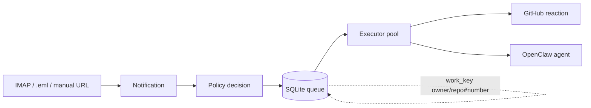

# Architecture

The bridge separates **fast mailbox ingestion** from **slow agent work**. That split is the core design choice.



## Design goals

| Goal | Design response |
| --- | --- |
| Do not block the inbox | Reader only fetches, classifies, and enqueues. |
| Do not lose work | Jobs are durable before cursors advance. |
| Do not duplicate thread work | Active jobs with the same `work_key` coalesce. |
| Do not serialize unrelated repos | Different `work_key`s can run in parallel. |
| Do not widen trust accidentally | Policy gates source, scope, actions, routes, and roles. |
| Do not let one failure jam everything | Failed dispatch marks one job `blocked`; unrelated jobs continue. |

## Components

### Reader

`ImapReader` fetches GitHub notification emails, parses metadata, and enqueues durable `Notification` jobs.

**Invariant:** advance `last_uid` only after the notification has been durably queued or safely ignored.

### Policy

`Policy` decides whether a trusted GitHub notification becomes:

- `auto`
- `auto_trusted`
- `ask`
- `deny`

It also selects delivery routes and repository roles for dispatched agent work.

### Queue

`JobQueue` uses SQLite/WAL.

| Table | Purpose |
| --- | --- |
| `jobs` | Durable work items and execution state. |
| `coalesced_notifications` | Extra emails folded into an active `work_key`. |
| `state` | Mailbox high-water marks and future cursors. |
| `worklog` | Audit trail. |

### Executor pool

The executor claims pending jobs with this constraint:

```sql
status = 'pending'
AND NOT EXISTS running job with same work_key
```

That permits parallelism across unrelated PRs/issues while serializing a single thread.

### Dispatch

Dispatch has two external side effects in live mode:

1. apply GitHub 👀 reaction when possible;
2. send one OpenClaw agent task with prompt rules and repository role context.

If dispatch fails, the job is marked `blocked`, `last_error` is stored, and the lock is released.

## Prompt resources

Prompt rules are packaged Markdown files:

```text
src/github_agent_bridge/prompt_rules/*.md
src/github_agent_bridge/prompt_rules/roles/*.md
```

They are loaded with `importlib.resources`, so they remain available from editable installs, wheels, and sdists.
