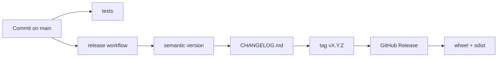

# Releases

The repository uses `python-semantic-release` from GitHub Actions to create versions automatically from Conventional Commits on `main`.

## Pipeline



## What happens on `main`

When commits land on `main`, the `release` workflow:

1. runs tests before release;
2. reads commits since the last `vX.Y.Z` tag;
3. decides the next SemVer version;
4. updates `pyproject.toml` (`project.version`);
5. updates `CHANGELOG.md`;
6. commits the release bump;
7. creates a `vX.Y.Z` tag;
8. creates a GitHub Release;
9. builds `sdist`/wheel artifacts and uploads them to the GitHub Release.

No PyPI publish is configured yet.

## Commit convention

| Commit | Release effect | Example |
| --- | --- | --- |
| `fix: ...` | patch | `0.2.0` → `0.2.1` |
| `feat: ...` | minor | `0.2.0` → `0.3.0` |
| `feat!: ...` | major | `0.2.0` → `1.0.0` |
| `BREAKING CHANGE: ...` | major | `0.2.0` → `1.0.0` |
| `docs: ...` | none | no release |
| `test: ...` | none | no release |
| `refactor: ...` | none by default | no release |
| `chore: ...` | none | no release |

Useful examples:

```text
fix: keep packaged prompt resources in wheels
feat: add retry policy for blocked jobs
feat!: change policy action names
```

## Manual run

The workflow can be triggered manually with `workflow_dispatch`. Manual runs still inspect commits and only release when commit history implies a new version.

## Configuration

| File | Purpose |
| --- | --- |
| `.github/workflows/release.yml` | Release workflow and permissions. |
| `pyproject.toml` | `python-semantic-release` configuration and package version. |
| `CHANGELOG.md` | Generated release notes. |

The workflow uses `GITHUB_TOKEN` with `contents: write` and `id-token: write` permissions.
