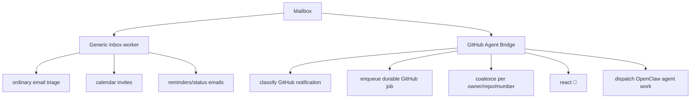

# Scope

`github-agent-bridge` is intentionally GitHub-only.

## Boundary

## Rules

| Rule | Reason |
| --- | --- |
| Do not become a generic inbox assistant. | Keeps policy, safety, and failure modes narrow. |
| Do not mutate non-GitHub mail. | Prevents accidental mailbox side effects. |
| Keep generic email logic elsewhere. | Calendar/status/personal triage has different semantics. |
| Accept delegated GitHub messages from another worker. | Allows a future single IMAP owner if needed. |

## Mailbox ownership

The bridge may scan the same mailbox with its own high-water cursor, but it must only mutate GitHub notification messages.

If a generic worker becomes the sole IMAP owner later, it can call `gab enqueue-json` for GitHub messages instead of letting the bridge read IMAP directly.
