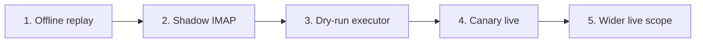

# Shadow and canary rollout

The safe path to production is staged. Do not jump straight from development to live mailbox mutation.



## 1. Offline replay

Replay saved GitHub notification emails as `.eml` files or an mbox.

```bash
gab --db /tmp/github-agent-bridge-shadow.sqlite3 init-db
gab --db /tmp/github-agent-bridge-shadow.sqlite3 --policy ./policy.json replay ./fixtures/github-emails --verbose
gab --db /tmp/github-agent-bridge-shadow.sqlite3 jobs --limit 50
```

Guarantees:

- no GitHub reaction;
- no OpenClaw agent dispatch;
- no IMAP mutation.

## 2. Shadow IMAP

Read live IMAP with an independent bridge DB cursor, but do **not** mark messages seen.

```bash
gab --db ~/.local/state/github-agent-bridge-shadow/bridge.sqlite3 read-imap-once \
  --email "$EMAIL" --password "$APP_PASSWORD"
gab --db ~/.local/state/github-agent-bridge-shadow/bridge.sqlite3 run --mode shadow --once --workers 4
```

> `read-imap-once` only marks GitHub messages seen when `--mark-seen` is explicitly passed. Do not pass it in shadow mode.

## 3. Dry-run executor

`--mode dry-run` claims jobs and renders intended side effects as successful without executing external calls.

Use this to validate:

- policy decisions;
- routes;
- repository roles;
- generated prompts;
- queue transitions.

## 4. Canary live

Use `enabledRepos` to constrain live scope to one repo.

```json
{
  "trustedOrgs": ["gisce"],
  "enabledRepos": ["gisce/erp"]
}
```

Then run live:

```bash
gab --policy ./policy-canary.json run --mode live --workers 2
```

## 5. Wider live scope

Only widen `enabledRepos`, `trustedRepos`, or `trustedOrgs` after canary behavior is clean.

## Rollback

Stop the bridge systemd unit and keep/restore the legacy inbox worker. The bridge DB remains inspectable after rollback.
